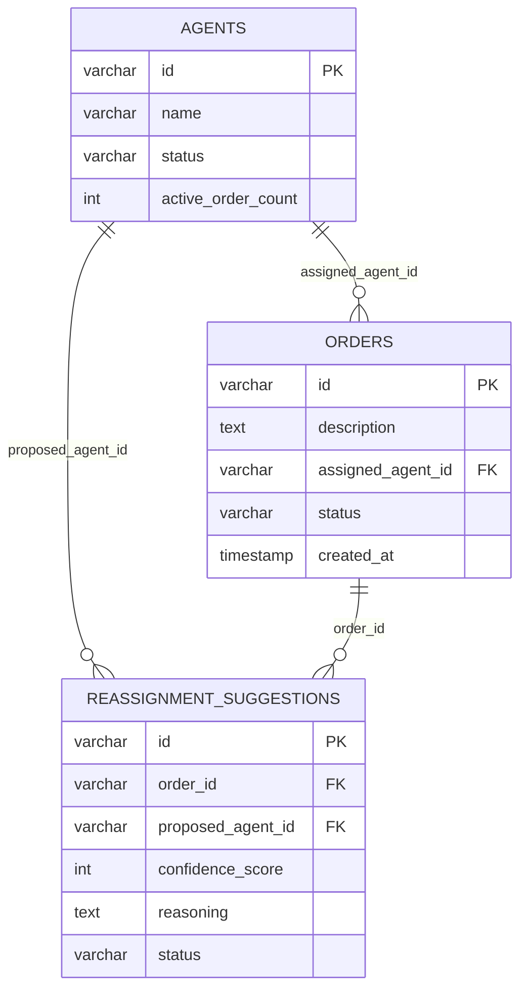

# API and Database Design: AI Reassignment Engine

## 1. API Design

The API is kept intentionally minimal to focus purely on the reassignment flow. Standard CRUD operations for entities are omitted to avoid scope creep for the 2.5-hour hackathon.

### 1.1 Trigger Agent Offline Event
- **HTTP method**: `PUT`
- **Path**: `/api/agents/{id}/offline`
- **Purpose**: Marks an agent as OFFLINE and automatically triggers the reassignment loop for their active orders.
- **Request DTO**: `{ "reason": "string" }` *(Optional: captures situation context like "Bike breakdown" for the AI)*
- **Response DTO**: 
  ```json
  {
    "agentId": "AGT-001",
    "status": "OFFLINE",
    "affectedOrdersCount": 2
  }
  ```
- **Validation**: Ensure `id` exists. Ensure agent is not already OFFLINE.
- **Status codes**: 200 OK, 404 Not Found, 400 Bad Request.
- **Error behavior**: Returns 400 if the agent is already offline.

### 1.2 Fetch Pending Suggestions
- **HTTP method**: `GET`
- **Path**: `/api/suggestions/pending`
- **Purpose**: Polled by the React UI to display suggestions waiting for ops approval.
- **Request DTO**: None.
- **Response DTO**: 
  ```json
  [
    {
      "id": "SUG-100",
      "orderId": "ORD-001",
      "orderDescription": "Electronics — Koramangala to Indiranagar",
      "proposedAgentId": "AGT-002",
      "proposedAgentName": "Rahul Verma",
      "confidenceScore": 92,
      "reasoning": "Rahul is currently AVAILABLE, has 0 active orders, and represents the lowest load risk."
    }
  ]
  ```
- **Validation**: None.
- **Status codes**: 200 OK.
- **Error behavior**: Returns empty array `[]` if no suggestions are pending.

### 1.3 Approve Suggestion
- **HTTP method**: `POST`
- **Path**: `/api/suggestions/{id}/approve`
- **Purpose**: Operations manager approves an AI/Rule reassignment recommendation.
- **Request DTO**: None.
- **Response DTO**: HTTP 204 No Content.
- **Validation**: Suggestion must exist and be `PENDING`. Proposed agent must still be `AVAILABLE`. Order must still be `ASSIGNED`.
- **Status codes**: 204 No Content, 404 Not Found, 409 Conflict.
- **Error behavior**: Returns 409 Conflict if the suggestion is already processed, or if the agent was assigned another critical load in the interim.

### 1.4 Reject Suggestion
- **HTTP method**: `POST`
- **Path**: `/api/suggestions/{id}/reject`
- **Purpose**: Operations manager dismisses a recommendation.
- **Request DTO**: None.
- **Response DTO**: HTTP 204 No Content.
- **Validation**: Suggestion must exist and be `PENDING`.
- **Status codes**: 204 No Content, 404 Not Found, 409 Conflict.
- **Error behavior**: Returns 409 Conflict if already processed.

### 1.5 Toggle Routing Strategy
- **HTTP method**: `PUT`
- **Path**: `/api/strategy/active`
- **Purpose**: Switches the active backend routing strategy at runtime without a restart.
- **Request DTO**: `{ "strategy": "RULE" | "AI" }`
- **Response DTO**: `{ "activeStrategy": "AI" }`
- **Validation**: `strategy` must exactly match allowed ENUM values.
- **Status codes**: 200 OK, 400 Bad Request.
- **Error behavior**: Returns 400 Bad Request if the payload is invalid.

---

## 2. Database Design

The schema is heavily normalized but stripped of unnecessary "Future Platform" fields (like lat/lon coordinates or timestamps on every state change) to maximize hackathon velocity.

### Table: `agents`
- **Columns**:
  - `id` (VARCHAR 36): Primary Key
  - `name` (VARCHAR 255): Not null
  - `status` (VARCHAR 20): Not null (AVAILABLE, BUSY, OFFLINE)
  - `active_order_count` (INT): Not null, default 0
- **Constraints**: `active_order_count >= 0`
- **Important Indexes**: `idx_agents_status` (Critical for rapidly pulling the roster of AVAILABLE agents for the AI prompt).

### Table: `orders`
- **Columns**:
  - `id` (VARCHAR 36): Primary Key
  - `description` (TEXT): Not null
  - `assigned_agent_id` (VARCHAR 36): Foreign Key -> `agents(id)`
  - `status` (VARCHAR 20): Not null (UNASSIGNED, ASSIGNED, COMPLETED)
  - `created_at` (TIMESTAMP): Not null
- **Constraints**: None.
- **Important Indexes**: `idx_orders_agent_status` on `(assigned_agent_id, status)` (Critical for instantly identifying affected active orders when an agent goes offline).

### Table: `reassignment_suggestions`
- **Columns**:
  - `id` (VARCHAR 36): Primary Key
  - `order_id` (VARCHAR 36): Foreign Key -> `orders(id)`
  - `proposed_agent_id` (VARCHAR 36): Foreign Key -> `agents(id)`
  - `confidence_score` (INT): Not null
  - `reasoning` (TEXT): Not null
  - `status` (VARCHAR 20): Not null (PENDING, APPROVED, REJECTED)
- **Constraints**: `confidence_score BETWEEN 0 AND 100`
- **Important Indexes**: `idx_suggestions_status` on `status` (Used constantly by the frontend polling `GET /pending`).

---

## 3. Entity Relationship Diagram



---

## 4. Database State Changes During Reassignment

To understand the core engine logic, here is the exact progression of database state updates during a full reassignment cycle:

1. **Initial Steady State**: 
   - Agent A: `status=AVAILABLE`, `active_order_count=1`
   - Order 1: `status=ASSIGNED`, `assigned_agent_id=Agent A`

2. **Trigger Offline**: (Ops/System calls `PUT /agents/A/offline`)
   - `agents` table: Updates Agent A to `status=OFFLINE`.

3. **Background Re-planning Loop**:
   - System queries `orders` where `assigned_agent_id=Agent A` and `status=ASSIGNED`. Finds Order 1.
   - The Routing Strategy runs, evaluates the roster, and selects Agent B.
   - `reassignment_suggestions` table: Inserts a new row for Order 1 proposing Agent B with `status=PENDING`.

4. **Ops Approval**: (Ops calls `POST /suggestions/1/approve`)
   - *A database transaction begins.*
   - `reassignment_suggestions` table: Updates suggestion to `status=APPROVED`.
   - `orders` table: Updates Order 1 to `assigned_agent_id=Agent B`.
   - `agents` table: Decrements Agent A's `active_order_count` by 1.
   - `agents` table: Increments Agent B's `active_order_count` by 1.
   - *The transaction commits.*
