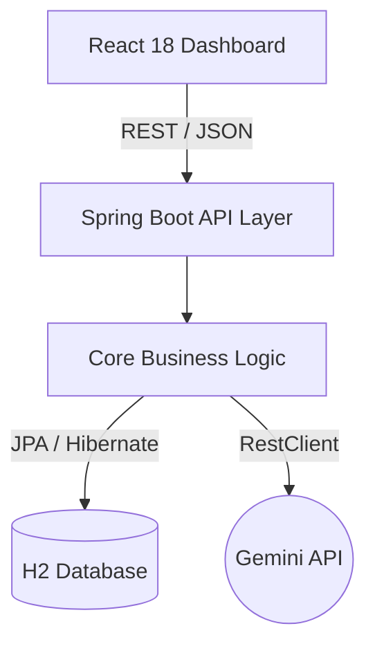
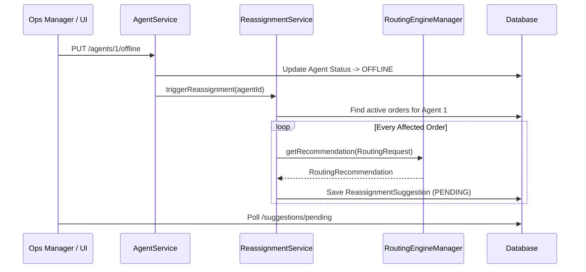
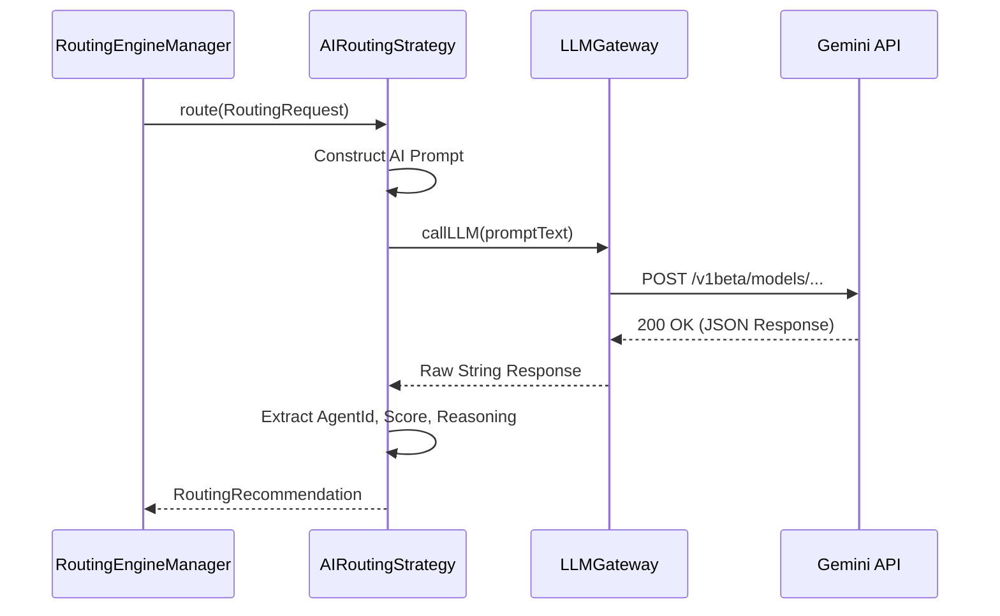

# Technical Architecture: AI Reassignment Engine

## A. High-Level Architecture
The system is built as a **Modular Monolith**. In a 2.5-hour solo hackathon, network boundaries and microservice orchestrations introduce fatal overhead. 
- **Frontend**: A minimal React 18 single-page application (SPA).
- **Backend**: A Spring Boot 3.x backend exposing a REST API.
- **Persistence**: H2 In-Memory database for zero-configuration, lightning-fast iteration.
- **External Integration**: Direct HTTP communication via `RestClient` to the Gemini API.

## B. Backend Component Architecture
The backend is vertically sliced into functional layers:
- **Controllers Layer**: 
  - `AgentController` (status updates)
  - `SuggestionController` (fetch/approve/reject)
  - `StrategyController` (toggle runtime strategy)
- **Service Layer (Core)**: 
  - `ReassignmentService` (orchestrates the re-planning loop)
  - `OrderService` & `AgentService` (standard CRUD/queries)
- **Routing Engine**:
  - `RoutingEngineManager` (holds the active strategy reference)
  - `RoutingStrategy` (Interface)
  - `RuleBasedRoutingStrategy` & `AIRoutingStrategy` (Implementations)
- **Repository Layer**: Spring Data JPA interfaces for persistence.

## C. Domain Architecture
The domain is kept pristine and ignorant of HTTP or Gemini.
- **Entities**: `Agent`, `Order`, `ReassignmentSuggestion` directly map to DB tables.
- **Value Objects**: `RoutingRequest`, `RoutingRecommendation`, `SituationContext` act as data-transfer objects strictly within the service layer (never exposed to REST controllers).
- **Enums**: Explicit state machines (`AgentStatus`, `OrderStatus`, `SuggestionStatus`).

## D. AI Architecture
Heavyweight abstractions (like Spring AI) are explicitly avoided to maintain total control over the JSON prompt structure and parsing, saving debugging time.
- **`LLMGateway`**: A generic component using Spring Boot 3's modern `RestClient`. It manages API keys, HTTP headers, and raw JSON exchange.
- **`AIRoutingStrategy`**: Implements the routing interface. It serializes the `RoutingRequest` into a highly specific text prompt, calls `LLMGateway`, and extracts the `recommendedAgentId`, `confidenceScore`, and `reasoning` from the raw response.

## E. API Architecture
A lightweight REST API optimized for the frontend UI:
- `PUT /api/agents/{id}/offline` - Triggers the reassignment loop.
- `GET /api/suggestions/pending` - Polled by React to show pending actions.
- `POST /api/suggestions/{id}/approve` - Executes reassignment.
- `POST /api/suggestions/{id}/reject` - Dismisses suggestion.
- `PUT /api/strategy/active` - Switches between "RULE" and "AI" at runtime.

## F. Database Architecture
Relational schema using JPA/Hibernate auto-DDL:
- **`agents`**: `id`, `name`, `status`, `active_order_count`
- **`orders`**: `id`, `description`, `assigned_agent_id`, `status`
- **`suggestions`**: `id`, `order_id`, `proposed_agent_id`, `score`, `reasoning`, `status`
Transactions are heavily utilized (e.g., approving a suggestion atomically updates the suggestion, order, and agent counts).

## G. Event / Re-planning Flow
We bypass complex messaging queues (RabbitMQ/Kafka) in favor of synchronous, programmatic event orchestration to fit the 2.5-hour constraint.
1. `AgentController` receives offline signal.
2. `AgentService` updates agent status and explicitly calls `ReassignmentService`.
3. `ReassignmentService` finds all `ASSIGNED` orders for that agent.
4. For each order, it delegates to `RoutingEngineManager.route(request)`.
5. The active strategy returns a recommendation.
6. `ReassignmentService` converts recommendations to `ReassignmentSuggestion` entities and saves them as `PENDING`.

## H. Error & Fallback Flow
AI calls are inherently unstable (timeouts, rate limits). 
- If `AIRoutingStrategy` throws an exception (HTTP 500 or JSON parse error), the `RoutingEngineManager` catches it.
- Instead of failing the entire loop, it immediately delegates the request to the injected `RuleBasedRoutingStrategy`.
- The system generates a valid, rule-based suggestion so Operations is never left stranded.

## I. Runtime Strategy-Switching Design
The application must swap strategies without a JVM restart.
- The `RoutingEngineManager` is a `@Service` that maintains a mutable reference to the `activeStrategy`.
- It injects both `RuleBasedRoutingStrategy` and `AIRoutingStrategy`.
- A simple `StrategyController` exposes an endpoint that updates the `RoutingEngineManager`'s internal pointer.
- The next time the reassignment loop runs, it simply routes through the newly referenced strategy.

