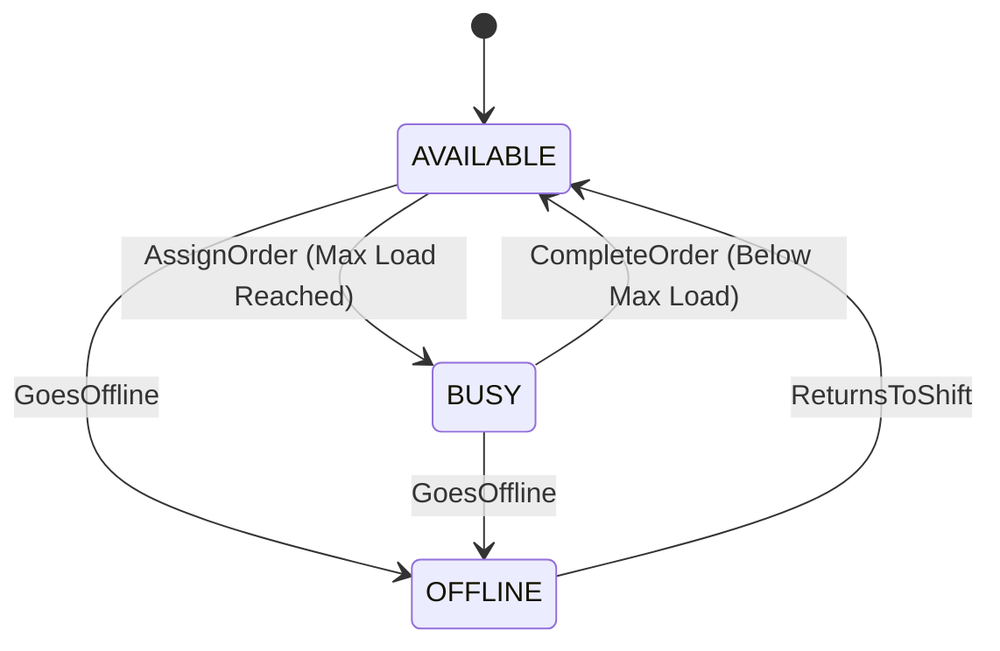
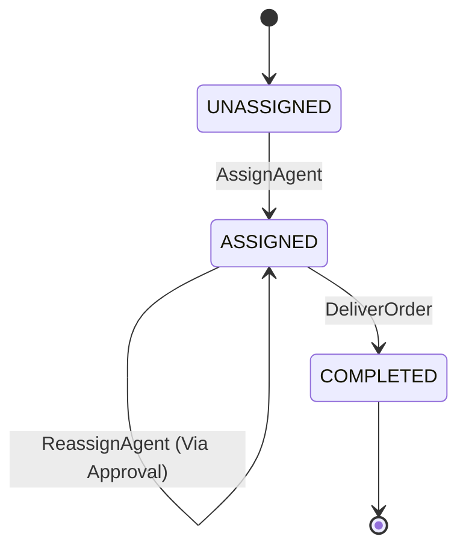
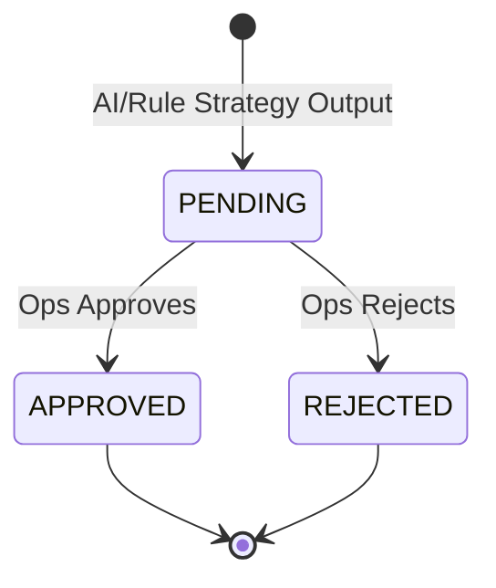

# AI Reassignment Engine: Domain Model & State Machines

## 1. Domain Entities & Concepts

### Agent (Entity)
- **Fields**: `id` (String), `name` (String), `status` (AgentStatus enum), `activeOrderCount` (Integer)
- **Relationships**: Implicitly related to `Order` via `assignedAgentId`.
- **Responsibilities**: Represents a delivery person, tracking their current availability and workload.
- **Invariants**: `activeOrderCount` must never be less than 0. `status` cannot be null.

### Order (Entity)
- **Fields**: `id` (String), `description` (String), `assignedAgentId` (String, nullable), `status` (OrderStatus enum), `createdAt` (Timestamp)
- **Relationships**: Holds a reference to the assigned `Agent`.
- **Responsibilities**: Represents a physical delivery task assigned to an agent.
- **Invariants**: If `status` is `ASSIGNED`, `assignedAgentId` must not be null. Cannot be assigned to an `OFFLINE` agent.

### ReassignmentSuggestion (Entity)
- **Fields**: `id` (String), `orderId` (String), `proposedAgentId` (String), `confidenceScore` (Integer), `reasoning` (String), `status` (SuggestionStatus enum)
- **Relationships**: References the `Order` needing reassignment and the `Agent` proposed to take it.
- **Responsibilities**: Persists an AI or rule-based recommendation so an Operations Manager can review it asynchronously.
- **Invariants**: `confidenceScore` must be between 0 and 100.

### RoutingStrategy (Domain Service Interface)
- **Fields**: None. (Behavioral abstraction)
- **Relationships**: Consumes a `RoutingRequest` and produces a `RoutingRecommendation`.
- **Responsibilities**: Defines the contract for selecting the best agent for a stranded order. Allows swapping Rule-based and AI-based logic at runtime.
- **Invariants**: Must deterministically return a valid recommendation or explicitly throw a routing failure exception.

### RoutingRequest (Value Object)
- **Fields**: `affectedOrder` (Order), `availableAgents` (List<Agent>), `context` (SituationContext)
- **Relationships**: Aggregates the necessary snapshot of data for the strategy.
- **Responsibilities**: Bundles all inputs required by a routing strategy to make a decision without needing to fetch from the DB.
- **Invariants**: `availableAgents` must not be empty. `affectedOrder` status must be `ASSIGNED`.

### RoutingRecommendation (Value Object)
- **Fields**: `recommendedAgentId` (String), `confidenceScore` (Integer), `reasoning` (String)
- **Relationships**: Directly maps to the fields needed to construct a `ReassignmentSuggestion`.
- **Responsibilities**: Represents the raw, ephemeral output of a `RoutingStrategy` before it is persisted for ops review.
- **Invariants**: `confidenceScore` must be between 0 and 100.

### SituationContext (Value Object)
- **Fields**: `offlineAgentId` (String), `triggerReason` (String), `timestamp` (Timestamp)
- **Relationships**: Wrapped inside the `RoutingRequest`.
- **Responsibilities**: Provides the contextual "Why is this happening?" to the AI to help it generate natural, plain-English reasoning (e.g., "Agent 001 is offline due to illness").
- **Invariants**: `offlineAgentId` must not be null.

---

## 2. State Machines

### 1. Agent State Machine

- **Current State**: `AVAILABLE`
  - **Trigger/Event**: `AssignOrder`
  - **New State**: `BUSY`
  - **Conditions**: Agent reaches maximum active order threshold.
- **Current State**: `BUSY`
  - **Trigger/Event**: `CompleteOrder`
  - **New State**: `AVAILABLE`
  - **Conditions**: Agent drops below maximum active order threshold.
- **Current State**: `AVAILABLE` / `BUSY`
  - **Trigger/Event**: `GoesOffline`
  - **New State**: `OFFLINE`
  - **Conditions**: None. (Forces reassignment loop).
- **Current State**: `OFFLINE`
  - **Trigger/Event**: `ReturnsToShift`
  - **New State**: `AVAILABLE`
  - **Conditions**: None.
- **Invalid Transitions**: `OFFLINE` -> `BUSY` (Must go through AVAILABLE first).

### 2. Order State Machine

- **Current State**: `UNASSIGNED`
  - **Trigger/Event**: `AssignAgent`
  - **New State**: `ASSIGNED`
  - **Conditions**: Target agent must not be `OFFLINE`.
- **Current State**: `ASSIGNED`
  - **Trigger/Event**: `ReassignAgent` (Via Suggestion Approval)
  - **New State**: `ASSIGNED`
  - **Conditions**: Target agent must not be `OFFLINE`.
- **Current State**: `ASSIGNED`
  - **Trigger/Event**: `DeliverOrder`
  - **New State**: `COMPLETED`
  - **Conditions**: Agent confirms delivery.
- **Invalid Transitions**: `COMPLETED` -> `UNASSIGNED`, `COMPLETED` -> `ASSIGNED`.

### 3. ReassignmentSuggestion State Machine

- **Current State**: `PENDING`
  - **Trigger/Event**: `ApproveSuggestion`
  - **New State**: `APPROVED`
  - **Conditions**: Order must still be `ASSIGNED` to the original offline agent. Proposed agent must still be `AVAILABLE`.
- **Current State**: `PENDING`
  - **Trigger/Event**: `RejectSuggestion`
  - **New State**: `REJECTED`
  - **Conditions**: None.
- **Invalid Transitions**: `APPROVED` -> `REJECTED`, `REJECTED` -> `APPROVED`. Once a decision is made, the suggestion is immutable.

